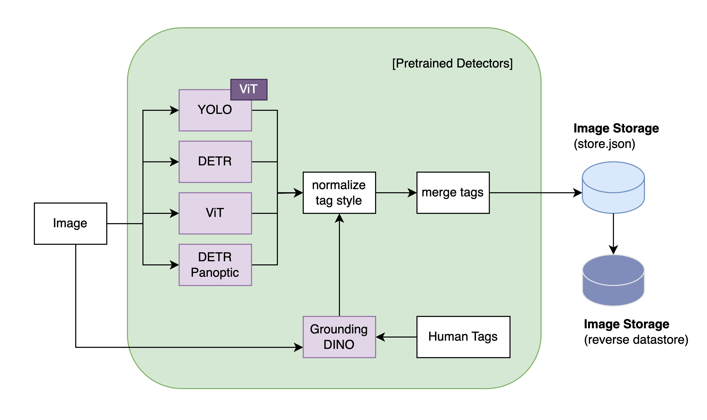
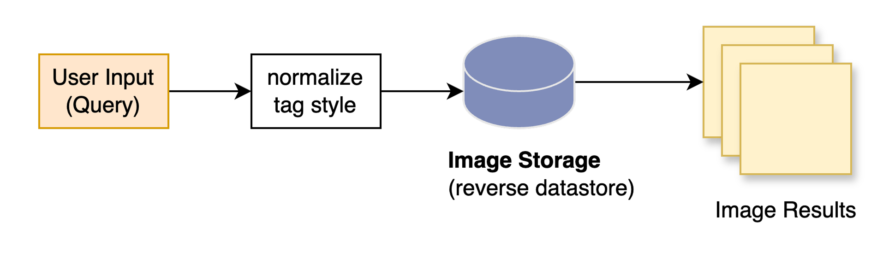

# Tag-Based Image Retrieval Using Pre-trained Object Detection Models

This repository contains the implementation of a novel, tag-based image retrieval system leveraging multiple pre-trained object detection models. The system does not require additional fine-tuning, offering a lightweight, scalable, and interpretable approach to visual search.

## Project Overview

This system combines state-of-the-art object detection models—YOLO, DETR, Vision Transformer (ViT), DETR Panoptic, and Grounding DINO—to extract visually grounded tags, enabling efficient and accurate image retrieval without hallucinations common in embedding-based or caption-based methods.

## Objectives

- Develop a tag extraction pipeline using pre-trained object detection models
- Create an effective keyword-based query matching process
- Analyze and compare different tagging strategies (fixed vs. open vocabulary)
- Document practical challenges and limitations for future enhancements

## System Architecture




### Tag Extraction Pipeline
- **YOLO**: General object detection
- **DETR & DETR Panoptic**: High-confidence detections and background elements
- **Vision Transformer (ViT)**: Image-level semantic understanding
- **Grounding DINO**: Open-vocabulary detection with human-defined tags

### Tag Storage and Indexing
- Forward and inverted indexing for fast, scalable retrieval
- Tag normalization and merging to maintain consistency

## Search Query Matching
- Simple text-based matching of normalized tags
- Supports both single and multi-term queries

## Project Structure
```
.
├── app.py                          # Gradio-based web interface
├── main.py                         # Entry point script
├── config/
│   ├── base_config.py              # General configuration settings
│   └── datastore/
│       ├── datastore.py            # Data store interface
│       ├── image_store.py          # Image tagging & storage logic
│       └── ml/
│           ├── detr_utils.py
│           ├── detr_panoptic_utils.py
│           ├── grounding_dino.py
│           ├── unique_tags.py
│           ├── vit_utils.py
│           └── yolo_utils.py
├── image_data/
│   ├── image_content.py            # Extracted noun/tag information
│   ├── image_object.py             # Object list per image
│   └── images/                     # Folder for image files
├── retrieve/
│   └── image_retrieval.py          # Semantic tag matching & retrieval
├── GroundingDINO/                 # Grounding DINO model directory
├── text_image/                    # Preprocessed image-text mapping
├── config.cfg                     # Configuration file
```


## Experimental Results

- Reliable detection for fixed-vocabulary objects
- Improved background element tagging using DETR Panoptic
- Limitations in attribute and abstract concept detection
- Significant indexing time (average ~15.9 sec/image), but instantaneous retrieval

## Future Enhancements

- Integration of BLIP-generated captions for expanded vocabulary
- Semantic relationship modeling (e.g., scene graphs)
- Attribute detection improvements (color, material, lighting)
- Computational optimization through adaptive model scheduling

## Acknowledgments
- Special thanks to the supervising committee:
  - Dr. Shounak Roychowdhury
  - Dr. Abhijit Mishra
- Computational resources provided by BRCF, UT Austin

## References
Refer to [project report](https://docs.google.com/document/d/1NaRM6SF_mSgG1UTAVkQ_BRzscMIamxlnqSnXWIqS3m4/edit?tab=t.0) for detailed methodologies and experiments.

---

© Jiwon Park, 2025. The University of Texas at Austin.
